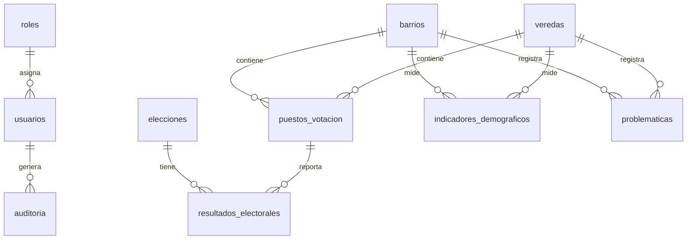

# Diagrama entidad-relación

```mermaid
erDiagram
  roles ||--o{ usuarios : asigna
  barrios ||--o{ puestos_votacion : contiene
  veredas ||--o{ puestos_votacion : contiene
  elecciones ||--o{ resultados_electorales : tiene
  puestos_votacion ||--o{ resultados_electorales : reporta
  barrios ||--o{ indicadores_demograficos : mide
  veredas ||--o{ indicadores_demograficos : mide
  barrios ||--o{ problematicas : registra
  veredas ||--o{ problematicas : registra
  usuarios ||--o{ auditoria : genera
```
